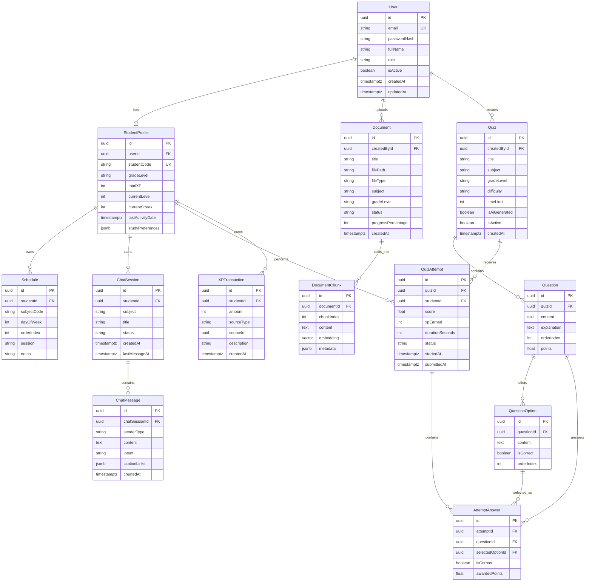
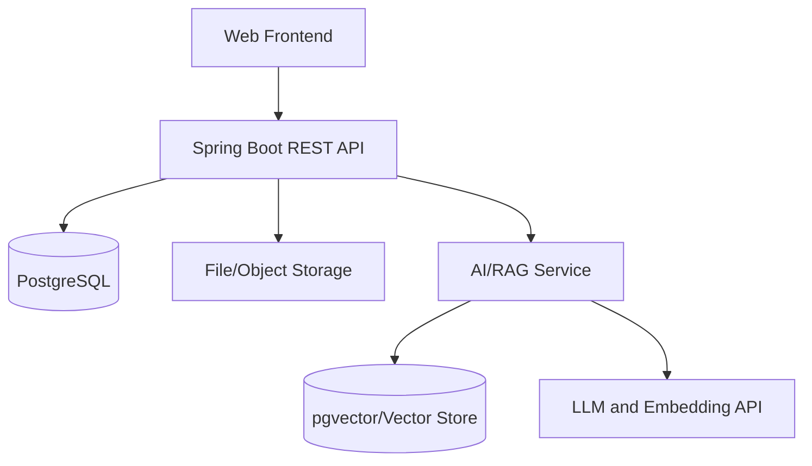

# SOFTWARE REQUIREMENTS SPECIFICATION (SRS)

## Hệ thống AI Tutor - Phiên bản MVP Demo

| Thuộc tính | Giá trị |
|---|---|
| Tên dự án | AI Tutor |
| Phiên bản tài liệu | 1.0 |
| Trạng thái | Baseline đề xuất để team phê duyệt |
| Mô hình phát triển | Agile Scrum |
| Thời gian triển khai | 8 tuần, 4 Sprint, mỗi Sprint 2 tuần |
| Quy mô đội ngũ | 3 người: Backend, Frontend, AI/Prompt & DevOps |
| Actor chính | Học sinh, Giáo viên, Quản trị viên |
| Phạm vi phát hành | MVP phục vụ demo |

---

## 1. Giới thiệu

### 1.1. Mục đích tài liệu

Tài liệu này mô tả phạm vi, yêu cầu nghiệp vụ, yêu cầu chức năng, yêu cầu phi chức năng, mô hình dữ liệu và tiêu chí nghiệm thu cho phiên bản MVP của hệ thống AI Tutor.

Tài liệu là baseline để:

- Thống nhất phạm vi giữa ba thành viên dự án.
- Tạo Product Backlog, User Story, Task và Test Case.
- Hạn chế phát sinh chức năng ngoài kế hoạch trong thời gian 8 tuần.
- Làm căn cứ nghiệm thu nội bộ và chuẩn bị kịch bản demo.

### 1.2. Mục tiêu sản phẩm

AI Tutor là nền tảng hỗ trợ học tập cá nhân hóa cho học sinh, tập trung vào bốn giá trị chính:

1. Học sinh có thể hỏi đáp với gia sư AI dựa trên tài liệu học tập đã được kiểm duyệt.
2. Học sinh có thể làm bài trắc nghiệm và nhận kết quả ngay.
3. Học sinh được ghi nhận XP để tăng động lực học tập.
4. Giáo viên và quản trị viên có thể quản lý nội dung, tài khoản và theo dõi số liệu cơ bản.

### 1.3. Đối tượng sử dụng tài liệu

- Backend Developer.
- Frontend Developer.
- AI Prompt Engineer/DevOps.
- Người phụ trách sản phẩm hoặc giảng viên hướng dẫn.
- Tester nội bộ của nhóm.

### 1.4. Thuật ngữ

| Thuật ngữ | Giải thích |
|---|---|
| AI Tutor | Gia sư AI tương tác với học sinh qua hội thoại |
| RAG | Retrieval-Augmented Generation, sinh câu trả lời dựa trên dữ liệu được truy xuất |
| Chunk | Đoạn văn bản nhỏ được tách từ tài liệu để tìm kiếm ngữ nghĩa |
| Citation | Thông tin nguồn được AI sử dụng để tạo câu trả lời |
| XP | Điểm kinh nghiệm nhận được từ hoạt động học tập |
| MVP | Phiên bản tối thiểu đủ để chạy và trình diễn luồng nghiệp vụ chính |
| RBAC | Kiểm soát quyền truy cập dựa trên vai trò |
| Attempt | Một lần học sinh thực hiện bài trắc nghiệm |
| Sprint | Chu kỳ phát triển kéo dài 2 tuần |

---

## 2. Phạm vi dự án

### 2.1. Phạm vi MVP bắt buộc - Must Have

- Đăng nhập, đăng xuất và phân quyền `STUDENT`, `TEACHER`, `ADMIN`.
- Quản lý hồ sơ học sinh ở mức cơ bản.
- Học sinh trò chuyện với AI Tutor theo phiên hội thoại.
- AI sử dụng RAG từ tài liệu đã xử lý và trả về nguồn tham khảo khi có.
- Giáo viên/Admin tải tài liệu lên và theo dõi trạng thái xử lý.
- Giáo viên/Admin tạo, sửa, kích hoạt hoặc vô hiệu hóa bài trắc nghiệm.
- Học sinh làm bài, nộp bài và xem kết quả.
- Ghi nhận XP sau khi hoàn thành hoạt động hợp lệ.
- Hiển thị bảng xếp hạng học sinh theo tổng XP.
- Học sinh quản lý lịch học cơ bản.
- Dashboard cơ bản cho học sinh và Admin/Giáo viên.
- Triển khai một môi trường demo có dữ liệu mẫu.

### 2.2. Phạm vi nên có - Should Have

- Sự kiện lịch cá nhân như kỳ thi, bài tập và lời nhắc.
- Bộ lọc lịch sử hội thoại theo môn học.
- Sinh câu hỏi trắc nghiệm bằng AI, có bước giáo viên duyệt trước khi phát hành.
- Báo cáo tổng hợp đơn giản theo khoảng thời gian.
- Streak học tập cơ bản.

Các chức năng `Should Have` chỉ được thực hiện khi toàn bộ `Must Have` đã đạt Definition of Done.

### 2.3. Ngoài phạm vi MVP - Won't Have

- Actor Phụ huynh và Super Admin.
- Thanh toán, gói thuê bao và hóa đơn.
- Lớp học trực tuyến, video call hoặc livestream.
- Chấm bài tự luận hoàn chỉnh bằng AI.
- Mạng xã hội, nhắn tin giữa người dùng.
- Hệ thống badge, cửa hàng quà tặng hoặc gamification nâng cao.
- Quản lý trường, lớp, khóa học và chương trình học phức tạp.
- Phân tích học tập dự đoán hoặc dashboard BI nâng cao.
- Ứng dụng mobile native.
- SSO, đăng nhập mạng xã hội và MFA.
- Fine-tune mô hình AI riêng.
- Hỗ trợ đa tenant hoặc nhiều tổ chức độc lập.

### 2.4. Tiêu chí thành công của MVP

- Ba actor đăng nhập và chỉ truy cập được chức năng đúng vai trò.
- Học sinh hoàn thành được luồng: đăng nhập -> hỏi AI -> xem nguồn -> làm quiz -> nhận XP -> xem thứ hạng.
- Giáo viên hoàn thành được luồng: đăng nhập -> tải tài liệu -> tài liệu được xử lý -> tạo/publish quiz -> xem kết quả cơ bản.
- Admin quản lý được trạng thái tài khoản và xem số liệu tổng quan.
- Hệ thống demo hoạt động ổn định trong một phiên trình bày tối thiểu 30 phút.
- Không có lỗi mức Critical/Blocker trong các luồng demo chính.

---

## 3. Actor và phân quyền

### 3.1. Học sinh - STUDENT

- Quản lý thông tin cá nhân được cho phép.
- Quản lý lịch học cá nhân.
- Tạo và xem lịch sử hội thoại của chính mình.
- Hỏi AI Tutor và xem citation.
- Xem và thực hiện quiz đang hoạt động phù hợp với khối lớp.
- Xem kết quả, XP, streak và leaderboard.
- Không được tạo tài liệu hoặc quiz.
- Không được truy cập dữ liệu riêng của học sinh khác.

### 3.2. Giáo viên - TEACHER

- Tải lên và quản lý tài liệu do mình tạo.
- Theo dõi trạng thái xử lý tài liệu.
- Tạo, sửa và quản lý quiz do mình tạo.
- Xem kết quả tổng hợp quiz ở mức cơ bản.
- Xem dashboard nội dung và hoạt động học tập tổng hợp.
- Không được thay đổi vai trò tài khoản hoặc cấu hình hệ thống.

### 3.3. Quản trị viên - ADMIN

- Quản lý tài khoản người dùng và trạng thái hoạt động.
- Quản lý toàn bộ tài liệu và quiz.
- Xem dashboard tổng quan hệ thống.
- Có thể khóa/mở khóa tài khoản.
- Không có actor Super Admin trong MVP; mọi Admin có cùng mức quyền.

### 3.4. Ma trận quyền

| Chức năng | Student | Teacher | Admin |
|---|:---:|:---:|:---:|
| Đăng nhập/đăng xuất | Có | Có | Có |
| Cập nhật hồ sơ cá nhân | Có | Có | Có |
| Quản lý lịch cá nhân | Có | Không | Không |
| Chat với AI Tutor | Có | Tùy chọn | Tùy chọn |
| Làm quiz | Có | Không | Không |
| Xem XP/leaderboard | Có | Có | Có |
| Tải và xử lý tài liệu | Không | Có | Có |
| Tạo/publish quiz | Không | Có | Có |
| Xem thống kê quiz | Không | Có | Có |
| Quản lý người dùng | Không | Không | Có |
| Xem dashboard hệ thống | Không | Giới hạn | Có |

---

## 4. Giả định và ràng buộc

### 4.1. Giả định

- MVP phục vụ demo với số lượng người dùng và dữ liệu nhỏ.
- Dữ liệu học tập chủ yếu là tiếng Việt.
- Giáo viên/Admin chịu trách nhiệm về tính hợp lệ của tài liệu và câu hỏi.
- Dịch vụ LLM và embedding được cung cấp qua API bên thứ ba.
- Tài liệu đầu vào ưu tiên PDF có text; OCR tài liệu scan không bắt buộc.
- Mỗi tài khoản chỉ có một vai trò trong MVP.
- `subject` và `gradeLevel` được lưu dạng chuỗi để giảm số bảng và nghiệp vụ quản trị danh mục.

### 4.2. Ràng buộc kỹ thuật

- Backend sử dụng Java, Spring Boot và Spring Data JPA.
- Database quan hệ ưu tiên PostgreSQL.
- Thay đổi schema phải được quản lý bằng Flyway hoặc Liquibase.
- Không dùng `spring.jpa.hibernate.ddl-auto=update` cho môi trường dùng chung hoặc production demo.
- Frontend sử dụng framework hiện có của team và giao tiếp qua REST API.
- Hệ thống được đóng gói bằng Docker; môi trường demo có cấu hình qua biến môi trường.
- Vector search có thể sử dụng `pgvector` hoặc một vector database do team lựa chọn.

### 4.3. Nguyên tắc kiểm soát phạm vi

- Mọi yêu cầu mới phải được đưa vào Product Backlog và đánh giá lại độ ưu tiên.
- Không thêm chức năng `Should Have` khi còn User Story `Must Have` chưa hoàn tất.
- Thay đổi ảnh hưởng database, API hoặc luồng demo phải được cả ba thành viên xác nhận.

---

## 5. Yêu cầu chức năng

### 5.1. Xác thực và tài khoản

| ID | Yêu cầu | Ưu tiên |
|---|---|---|
| FR-AUTH-01 | Hệ thống cho phép người dùng đăng nhập bằng email và mật khẩu | Must |
| FR-AUTH-02 | Hệ thống phát hành token/phiên đăng nhập và cho phép đăng xuất | Must |
| FR-AUTH-03 | Hệ thống từ chối đăng nhập nếu tài khoản bị vô hiệu hóa | Must |
| FR-AUTH-04 | Hệ thống phân quyền API và giao diện theo `STUDENT`, `TEACHER`, `ADMIN` | Must |
| FR-AUTH-05 | Admin có thể xem danh sách, tìm kiếm và khóa/mở khóa tài khoản | Must |
| FR-AUTH-06 | Mật khẩu phải được băm; không lưu hoặc ghi log mật khẩu thô | Must |
| FR-AUTH-07 | Chức năng quên mật khẩu qua email | Won't Have |

### 5.2. Hồ sơ học sinh

| ID | Yêu cầu | Ưu tiên |
|---|---|---|
| FR-PRO-01 | Hệ thống lưu hồ sơ học sinh liên kết một-một với tài khoản | Must |
| FR-PRO-02 | Học sinh xem và cập nhật các trường hồ sơ được cho phép | Must |
| FR-PRO-03 | Hệ thống hiển thị tổng XP, cấp độ và streak hiện tại | Must |
| FR-PRO-04 | Email đăng nhập chỉ lưu tại bảng `User`, không lặp lại ở hồ sơ học sinh | Must |

### 5.3. Lịch học

| ID | Yêu cầu | Ưu tiên |
|---|---|---|
| FR-SCH-01 | Học sinh tạo lịch học gồm môn, thứ, tiết/buổi và ghi chú | Must |
| FR-SCH-02 | Học sinh xem, sửa và xóa lịch của chính mình | Must |
| FR-SCH-03 | Hệ thống kiểm tra giá trị ngày trong tuần từ 1 đến 7 | Must |
| FR-SCH-04 | Học sinh tạo sự kiện có thời gian bắt đầu/kết thúc và loại sự kiện | Should |
| FR-SCH-05 | Nhắc lịch bằng push notification/email | Won't Have |

### 5.4. AI Tutor và hội thoại

| ID | Yêu cầu | Ưu tiên |
|---|---|---|
| FR-CHAT-01 | Học sinh tạo phiên hội thoại mới theo môn học | Must |
| FR-CHAT-02 | Học sinh gửi câu hỏi dạng văn bản và nhận câu trả lời AI | Must |
| FR-CHAT-03 | Hệ thống lưu tin nhắn theo đúng thứ tự thời gian | Must |
| FR-CHAT-04 | Học sinh xem lại danh sách và nội dung phiên chat của chính mình | Must |
| FR-CHAT-05 | AI truy xuất các chunk phù hợp trước khi sinh câu trả lời | Must |
| FR-CHAT-06 | Câu trả lời hiển thị citation khi có nguồn phù hợp | Must |
| FR-CHAT-07 | AI phải nêu rõ không đủ dữ liệu khi retrieval không đạt ngưỡng tin cậy | Must |
| FR-CHAT-08 | Hệ thống không cho phép người dùng xem phiên chat của người khác | Must |
| FR-CHAT-09 | Học sinh đóng hoặc đổi tiêu đề phiên chat | Should |
| FR-CHAT-10 | Nhập/xuất giọng nói | Won't Have |

### 5.5. Tài liệu và RAG

| ID | Yêu cầu | Ưu tiên |
|---|---|---|
| FR-DOC-01 | Giáo viên/Admin tải lên tài liệu với định dạng được hỗ trợ | Must |
| FR-DOC-02 | Hệ thống lưu metadata: tên file, kích thước, loại, môn, khối và người tạo | Must |
| FR-DOC-03 | Hệ thống hiển thị trạng thái `PROCESSING`, `SUCCESS`, `FAILED` | Must |
| FR-DOC-04 | Pipeline trích xuất text, chia chunk, tạo embedding và lưu kết quả | Must |
| FR-DOC-05 | Chỉ tài liệu có trạng thái `SUCCESS` được sử dụng cho retrieval | Must |
| FR-DOC-06 | Giáo viên quản lý tài liệu của mình; Admin quản lý mọi tài liệu | Must |
| FR-DOC-07 | Hệ thống lưu thông báo lỗi xử lý đủ để chẩn đoán nội bộ | Should |
| FR-DOC-08 | OCR tài liệu scan và xử lý ảnh/bảng phức tạp | Won't Have |

### 5.6. Quiz và luyện tập

| ID | Yêu cầu | Ưu tiên |
|---|---|---|
| FR-QUIZ-01 | Giáo viên/Admin tạo quiz gồm tiêu đề, môn, khối, độ khó và thời gian | Must |
| FR-QUIZ-02 | Mỗi quiz có nhiều câu hỏi trắc nghiệm một đáp án đúng | Must |
| FR-QUIZ-03 | Mỗi câu hỏi có tối thiểu 2 phương án và đúng 1 đáp án đúng | Must |
| FR-QUIZ-04 | Người tạo có thể sửa quiz trước khi kích hoạt | Must |
| FR-QUIZ-05 | Học sinh chỉ thấy quiz đang hoạt động và phù hợp khối lớp | Must |
| FR-QUIZ-06 | Hệ thống ghi nhận đáp án, thời gian và tính điểm khi nộp bài | Must |
| FR-QUIZ-07 | Học sinh xem điểm, số câu đúng và đáp án/giải thích sau khi nộp | Must |
| FR-QUIZ-08 | Hệ thống không chấp nhận nộp lại cùng một attempt đã hoàn tất | Must |
| FR-QUIZ-09 | AI có thể đề xuất quiz, nhưng giáo viên phải duyệt trước khi kích hoạt | Should |
| FR-QUIZ-10 | Câu hỏi nhiều đáp án, tự luận hoặc upload bài làm | Won't Have |

### 5.7. XP và bảng xếp hạng

| ID | Yêu cầu | Ưu tiên |
|---|---|---|
| FR-XP-01 | Hệ thống cộng XP khi học sinh nộp quiz hợp lệ | Must |
| FR-XP-02 | Mỗi sự kiện chỉ được cộng XP một lần | Must |
| FR-XP-03 | Hệ thống lưu lịch sử giao dịch XP để truy vết | Must |
| FR-XP-04 | Hệ thống cập nhật `totalXP` của học sinh sau giao dịch thành công | Must |
| FR-XP-05 | Leaderboard sắp xếp theo tổng XP giảm dần | Must |
| FR-XP-06 | Khi bằng XP, ưu tiên người đạt mức XP đó sớm hơn | Should |
| FR-XP-07 | Badge, đổi quà và shop | Won't Have |

### 5.8. Dashboard và báo cáo

| ID | Yêu cầu | Ưu tiên |
|---|---|---|
| FR-REP-01 | Dashboard học sinh hiển thị XP, level, streak, quiz gần đây và lịch học | Must |
| FR-REP-02 | Dashboard giáo viên hiển thị số tài liệu, quiz và lượt làm quiz liên quan | Must |
| FR-REP-03 | Dashboard Admin hiển thị tổng user, tài liệu, quiz và lượt chat/attempt | Must |
| FR-REP-04 | Giáo viên/Admin xem bảng kết quả theo quiz | Must |
| FR-REP-05 | Xuất PDF/Excel và phân tích nâng cao | Won't Have |

---

## 6. User Story và tiêu chí nghiệm thu

### US-01 - Đăng nhập

**Là** người dùng, **tôi muốn** đăng nhập bằng email và mật khẩu **để** truy cập chức năng theo vai trò.

**Acceptance Criteria:**

- Với tài khoản hợp lệ và đang hoạt động, đăng nhập thành công và trả về thông tin vai trò.
- Với mật khẩu sai, hệ thống trả thông báo chung và không tiết lộ tài khoản có tồn tại hay không.
- Với tài khoản bị khóa, hệ thống từ chối truy cập.
- API thuộc vai trò khác trả về `403 Forbidden`.

### US-02 - Quản lý tài khoản

**Là** Admin, **tôi muốn** xem và khóa/mở khóa tài khoản **để** kiểm soát quyền truy cập hệ thống.

**Acceptance Criteria:**

- Admin xem được danh sách có phân trang và tìm theo email/tên.
- Admin thay đổi được `isActive`.
- Người không phải Admin không truy cập được chức năng này.
- Admin không thể vô tình khóa chính tài khoản đang sử dụng nếu đây là Admin hoạt động cuối cùng của demo.

### US-03 - Quản lý lịch học

**Là** học sinh, **tôi muốn** quản lý lịch học cá nhân **để** theo dõi kế hoạch học tập.

**Acceptance Criteria:**

- Học sinh tạo, xem, sửa và xóa lịch của mình.
- `dayOfWeek` chỉ nhận giá trị 1-7.
- Không thể sửa hoặc xóa lịch của học sinh khác.
- Lịch được hiển thị theo thứ và thứ tự tiết học.

### US-04 - Tạo phiên chat

**Là** học sinh, **tôi muốn** tạo một phiên chat theo môn **để** đặt câu hỏi cho AI Tutor.

**Acceptance Criteria:**

- Phiên mới có `studentId`, môn, tiêu đề, trạng thái và thời gian tạo.
- Học sinh xem được danh sách phiên của chính mình theo thời gian mới nhất.
- Phiên chat của học sinh khác không thể truy cập bằng cách thay ID trên URL/API.

### US-05 - Hỏi AI bằng RAG

**Là** học sinh, **tôi muốn** nhận câu trả lời dựa trên tài liệu học **để** có thông tin đáng tin cậy hơn.

**Acceptance Criteria:**

- Câu hỏi và câu trả lời được lưu vào đúng phiên.
- Pipeline retrieval trả về các chunk phù hợp theo môn/khối nếu có.
- Câu trả lời có citation gồm tối thiểu tên tài liệu và vị trí/chunk tham chiếu.
- Khi không có nguồn đủ phù hợp, AI nêu rõ giới hạn thay vì bịa nguồn.
- Lỗi LLM được xử lý và hiển thị thông báo có thể thử lại.

### US-06 - Tải tài liệu

**Là** giáo viên, **tôi muốn** tải tài liệu học tập lên **để** bổ sung nguồn cho AI Tutor.

**Acceptance Criteria:**

- Hệ thống kiểm tra định dạng và kích thước trước khi xử lý.
- Tài liệu được tạo với trạng thái `PROCESSING`.
- Xử lý thành công chuyển sang `SUCCESS` và tạo các `DocumentChunk`.
- Xử lý lỗi chuyển sang `FAILED`, không được dùng cho retrieval.
- Người tải lên và Admin xem được trạng thái tài liệu.

### US-07 - Tạo quiz

**Là** giáo viên, **tôi muốn** tạo quiz có câu hỏi và đáp án **để** học sinh luyện tập.

**Acceptance Criteria:**

- Quiz lưu được thông tin chung, danh sách câu hỏi và phương án.
- Mỗi câu hỏi có đúng một đáp án được đánh dấu đúng.
- Quiz không hợp lệ không thể kích hoạt.
- Giáo viên chỉ sửa nội dung do mình tạo; Admin có thể sửa mọi quiz.

### US-08 - Làm và nộp quiz

**Là** học sinh, **tôi muốn** làm và nộp quiz **để** biết kết quả học tập.

**Acceptance Criteria:**

- Hệ thống tạo một `QuizAttempt` khi bắt đầu hoặc nộp bài theo thiết kế API thống nhất.
- Mỗi đáp án được lưu gắn với attempt và câu hỏi.
- Điểm được tính phía server, không tin điểm gửi từ client.
- Sau khi nộp, attempt có thời gian, điểm và trạng thái hoàn tất.
- Hệ thống trả kết quả và giải thích nếu câu hỏi có giải thích.

### US-09 - Nhận XP

**Là** học sinh, **tôi muốn** nhận XP sau hoạt động học tập **để** theo dõi tiến bộ.

**Acceptance Criteria:**

- Nộp quiz hợp lệ tạo đúng một `XPTransaction`.
- Cùng một attempt không thể cộng XP hai lần.
- `totalXP` và giao dịch XP được cập nhật trong cùng transaction database.
- XP hiển thị trên dashboard sau khi cập nhật.

### US-10 - Xem leaderboard

**Là** học sinh, **tôi muốn** xem bảng xếp hạng **để** so sánh tiến độ học tập.

**Acceptance Criteria:**

- Danh sách hiển thị tên, tổng XP, level và thứ hạng.
- Mặc định trả tối đa số lượng bản ghi được cấu hình, ví dụ top 20.
- Không hiển thị email, địa chỉ hoặc dữ liệu cá nhân nhạy cảm.

### US-11 - Xem dashboard học sinh

**Là** học sinh, **tôi muốn** xem tóm tắt hoạt động **để** biết việc cần học và kết quả gần đây.

**Acceptance Criteria:**

- Hiển thị XP, level, streak, lịch học và các quiz gần đây.
- Dữ liệu chỉ thuộc về học sinh đang đăng nhập.
- Trạng thái trống được hiển thị hợp lý khi chưa có dữ liệu.

### US-12 - Xem dashboard quản trị

**Là** Admin/Giáo viên, **tôi muốn** xem số liệu tổng quan **để** theo dõi hoạt động hệ thống.

**Acceptance Criteria:**

- Admin thấy số lượng user, tài liệu, quiz và attempt.
- Giáo viên chỉ thấy số liệu liên quan đến nội dung của mình khi áp dụng.
- Dashboard tải được với dữ liệu mẫu trong giới hạn hiệu năng của MVP.

### US-13 - Cập nhật hồ sơ học sinh

**Là** học sinh, **tôi muốn** xem và cập nhật hồ sơ cá nhân **để** thông tin học tập của tôi luôn chính xác.

**Acceptance Criteria:**

- Học sinh xem được hồ sơ liên kết với tài khoản đang đăng nhập.
- Học sinh chỉ sửa được các trường được cho phép như tên hiển thị, khối lớp và tùy chọn học tập.
- Học sinh không thể tự thay đổi role, tổng XP hoặc trạng thái tài khoản.
- Email đăng nhập được lấy từ `User`, không lấy từ trường email trùng trong `Student` cũ.

### US-14 - Xem kết quả quiz

**Là** giáo viên, **tôi muốn** xem kết quả tổng hợp của quiz mình tạo **để** đánh giá mức độ hoàn thành của học sinh.

**Acceptance Criteria:**

- Giáo viên xem được số lượt làm, điểm trung bình và danh sách kết quả của quiz do mình tạo.
- Admin xem được kết quả của mọi quiz.
- Học sinh không truy cập được báo cáo tổng hợp của người khác.
- Danh sách kết quả hỗ trợ phân trang và không hiển thị dữ liệu cá nhân không cần thiết.

---

## 7. Quy tắc nghiệp vụ

| ID | Quy tắc |
|---|---|
| BR-01 | Email đăng nhập là duy nhất, không phân biệt chữ hoa/chữ thường |
| BR-02 | Mỗi `StudentProfile` thuộc đúng một `User` có role `STUDENT` |
| BR-03 | Mỗi user chỉ có một role trong MVP |
| BR-04 | Chỉ user đang hoạt động mới được xác thực |
| BR-05 | Teacher/Admin mới được tạo tài liệu và quiz |
| BR-06 | Chỉ tài liệu `SUCCESS` được sử dụng trong RAG |
| BR-07 | Quiz chỉ được kích hoạt khi có ít nhất một câu hỏi hợp lệ |
| BR-08 | Mỗi câu hỏi MVP có đúng một đáp án đúng |
| BR-09 | Điểm quiz được tính ở backend |
| BR-10 | Một `QuizAttempt` hoàn tất chỉ được ghi nhận XP một lần |
| BR-11 | Tổng XP không được âm |
| BR-12 | User chỉ truy cập dữ liệu thuộc quyền sở hữu hoặc phạm vi vai trò của mình |
| BR-13 | Xóa dữ liệu có liên kết ưu tiên soft delete/vô hiệu hóa thay vì xóa vật lý trong MVP |

### 7.1. Công thức điểm và XP mặc định

- `score = correctAnswers / totalQuestions * 100`.
- Làm tròn điểm đến 2 chữ số thập phân.
- XP cơ bản cho một attempt hoàn tất: `10 + floor(score / 10)`.
- XP tối đa mặc định từ một attempt: 20.
- Công thức phải đặt trong cấu hình/service để có thể điều chỉnh, không hard-code ở frontend.

---

## 8. Mô hình dữ liệu MVP

### 8.1. Nguyên tắc cập nhật database hiện có

Database đã triển khai theo ERD ban đầu được giữ lại. Không yêu cầu viết lại toàn bộ schema. Team bổ sung các entity còn thiếu bằng migration:

- Bắt buộc: `Question`, `QuestionOption`, `AttemptAnswer`, `DocumentChunk`.
- Khuyến nghị mạnh: `XPTransaction` để chống cộng điểm trùng và truy vết.
- Sửa enum/quy tắc role của `User` để hỗ trợ `TEACHER`.
- Quan hệ upload tài liệu thuộc về `User.createdById`, không giới hạn ở `Student`.
- `Lesson` chưa cần dùng trong MVP; có thể giữ bảng nếu đã tạo nhưng không phát triển nghiệp vụ phụ thuộc.
- `Student.email` là dữ liệu trùng; không sử dụng làm nguồn email đăng nhập và nên loại bỏ ở migration sau.

### 8.2. ERD chốt cho MVP



### 8.3. Ràng buộc database quan trọng

- Unique index trên `lower(User.email)`.
- Unique trên `StudentProfile.userId` và `studentCode`.
- Unique trên `(DocumentChunk.documentId, chunkIndex)`.
- Unique trên `(QuestionOption.questionId, orderIndex)`.
- Unique trên `(AttemptAnswer.attemptId, questionId)`.
- Unique trên `(XPTransaction.studentId, sourceType, sourceId)` để chống cộng XP trùng.
- Check constraint `Schedule.dayOfWeek BETWEEN 1 AND 7`.
- Check constraint `XPTransaction.amount <> 0` và `StudentProfile.totalXP >= 0`.
- Index trên các khóa ngoại, `ChatSession.lastMessageAt`, `Quiz.isActive`, `Document.status`.
- Vector index được tạo theo extension/vector store được chọn.

### 8.4. Migration đề xuất

| Migration | Nội dung |
|---|---|
| `V1__baseline.sql` | Schema hiện tại đã thống nhất |
| `V2__add_teacher_role.sql` | Bổ sung role `TEACHER` nếu database dùng enum/check constraint |
| `V3__add_quiz_question_tables.sql` | Thêm Question, QuestionOption, AttemptAnswer và trường trạng thái attempt |
| `V4__add_document_chunks.sql` | Thêm DocumentChunk và vector index |
| `V5__add_xp_transactions.sql` | Thêm XPTransaction và unique chống cộng trùng |

---

## 9. API mức cao

API sử dụng prefix đề xuất `/api/v1`. Chi tiết request/response được quản lý bằng OpenAPI/Swagger trong source code.

| Nhóm | Endpoint chính đề xuất |
|---|---|
| Auth | `POST /auth/login`, `POST /auth/logout`, `GET /auth/me` |
| Users | `GET /users`, `PATCH /users/{id}/status` |
| Profile | `GET /students/me`, `PATCH /students/me` |
| Schedule | `GET/POST /schedules`, `PUT/DELETE /schedules/{id}` |
| Chat | `GET/POST /chat-sessions`, `GET /chat-sessions/{id}`, `POST /chat-sessions/{id}/messages` |
| Documents | `GET/POST /documents`, `GET /documents/{id}`, `DELETE /documents/{id}` |
| Quiz admin | `GET/POST /quizzes`, `PUT /quizzes/{id}`, `PATCH /quizzes/{id}/status` |
| Quiz student | `GET /quizzes/available`, `POST /quizzes/{id}/attempts`, `POST /attempts/{id}/submit` |
| Progress | `GET /students/me/progress`, `GET /leaderboard` |
| Dashboard | `GET /dashboard/student`, `GET /dashboard/teacher`, `GET /dashboard/admin` |

### 9.1. Chuẩn phản hồi lỗi

Mọi lỗi API nên trả cấu trúc thống nhất:

```json
{
  "timestamp": "2026-01-01T10:00:00Z",
  "status": 400,
  "code": "VALIDATION_ERROR",
  "message": "Dữ liệu không hợp lệ",
  "fieldErrors": {
    "email": "Email không đúng định dạng"
  },
  "traceId": "request-trace-id"
}
```

Frontend không phụ thuộc vào thông báo exception thô từ backend.

---

## 10. Yêu cầu AI và RAG

### 10.1. Pipeline xử lý tài liệu

1. Giáo viên/Admin tải file.
2. Backend kiểm tra loại file, kích thước và quyền.
3. Tài liệu được lưu với trạng thái `PROCESSING`.
4. Worker/service trích xuất text.
5. Text được chuẩn hóa và chia thành chunk có overlap.
6. Hệ thống tạo embedding và lưu `DocumentChunk`.
7. Thành công chuyển trạng thái sang `SUCCESS`; thất bại chuyển `FAILED`.

### 10.2. Pipeline trả lời

1. Kiểm tra quyền truy cập phiên chat.
2. Chuẩn hóa câu hỏi và xác định môn/khối từ ngữ cảnh.
3. Tạo embedding cho truy vấn.
4. Lấy top-K chunk và áp dụng ngưỡng tương đồng.
5. Xây prompt gồm system instruction, lịch sử chat giới hạn và context.
6. Gọi LLM với timeout và giới hạn token.
7. Lưu câu trả lời cùng citation ở `ChatMessage.citationLinks`.

### 10.3. Nguyên tắc prompt

- Trả lời bằng tiếng Việt rõ ràng, phù hợp cấp học.
- Ưu tiên gợi mở cách làm thay vì chỉ đưa đáp án khi phù hợp.
- Không tuyên bố nội dung nằm trong tài liệu nếu không có citation tương ứng.
- Không được làm lộ system prompt, API key hoặc dữ liệu của người dùng khác.
- Không sử dụng lịch sử chat vượt ngoài phiên hiện tại.
- Khi câu hỏi ngoài dữ liệu hoặc ngoài phạm vi học tập, trả lời ngắn gọn và nêu giới hạn.

### 10.4. Chỉ số AI cho demo

- Tập kiểm thử tối thiểu 20 câu hỏi thuộc tài liệu demo.
- Ít nhất 80% câu hỏi có retrieval đúng tài liệu/chunk theo đánh giá thủ công.
- Không có citation giả trong tập kiểm thử đã chuẩn bị.
- Theo dõi latency, lỗi API, số token hoặc chi phí ước tính ở log nội bộ.

---

## 11. Yêu cầu phi chức năng

### 11.1. Hiệu năng

| ID | Yêu cầu |
|---|---|
| NFR-PERF-01 | API CRUD thông thường có thời gian phản hồi mục tiêu dưới 2 giây ở tải demo |
| NFR-PERF-02 | Phản hồi AI mục tiêu dưới 15 giây; UI phải hiển thị trạng thái đang xử lý |
| NFR-PERF-03 | Danh sách phải hỗ trợ phân trang, mặc định không quá 20-50 bản ghi/trang |
| NFR-PERF-04 | Hệ thống hỗ trợ tối thiểu 20 người dùng đồng thời trong môi trường demo |

### 11.2. Bảo mật

| ID | Yêu cầu |
|---|---|
| NFR-SEC-01 | Mật khẩu được băm bằng BCrypt hoặc Argon2 |
| NFR-SEC-02 | Mọi endpoint nghiệp vụ được xác thực và kiểm tra quyền phía server |
| NFR-SEC-03 | API key và secret chỉ lưu trong biến môi trường/secret store |
| NFR-SEC-04 | Validate loại file, kích thước file và tên file upload |
| NFR-SEC-05 | Không ghi log mật khẩu, token, API key hoặc toàn bộ dữ liệu cá nhân nhạy cảm |
| NFR-SEC-06 | CORS chỉ cho phép origin của frontend demo |
| NFR-SEC-07 | Production/demo public phải sử dụng HTTPS |
| NFR-SEC-08 | Truy vấn dữ liệu phải kiểm tra ownership để tránh IDOR |

### 11.3. Tin cậy và toàn vẹn dữ liệu

- Giao dịch nộp quiz, tính điểm và cộng XP phải bảo đảm idempotency.
- Upload hoặc xử lý AI thất bại không được làm mất dữ liệu tài liệu gốc đã hợp lệ.
- Database demo được backup trước buổi trình bày.
- Migration phải chạy tự động và theo đúng thứ tự khi deploy.
- Lỗi tích hợp LLM không làm crash toàn bộ backend.

### 11.4. Khả dụng và giao diện

- Giao diện responsive cho desktop và mobile web ở mức cơ bản.
- Có trạng thái loading, empty, error và retry cho các luồng bất đồng bộ.
- Form hiển thị lỗi validation gần trường nhập.
- Các thao tác xóa/khóa phải có xác nhận.
- Ngôn ngữ giao diện chính là tiếng Việt.

E 
### 11.5. Khả năng bảo trì

- Backend phân tách controller, service, repository, DTO và entity.
- Không trả trực tiếp JPA entity từ API.
- Có OpenAPI/Swagger cho endpoint MVP.
- Có migration database được version hóa trong repository.
- Cấu hình môi trường không hard-code trong source code.

### 11.6. Logging và giám sát

- Mỗi request có `traceId` hoặc correlation ID.
- Log các sự kiện: đăng nhập thất bại, upload tài liệu, xử lý RAG, nộp quiz và cộng XP.
- Health endpoint kiểm tra trạng thái ứng dụng và database.
- Không bắt buộc hệ thống observability đầy đủ; log container và health check là đủ cho MVP.

---

## 12. Kiến trúc logic đề xuất



Để phù hợp team nhỏ, Backend có thể là modular monolith. AI/RAG có thể nằm trong cùng repository/service nếu công nghệ phù hợp, hoặc là service nhỏ riêng; không cần thiết kế microservice phức tạp cho MVP.

### 12.1. Module backend đề xuất

- `auth`: xác thực và RBAC.
- `user`: tài khoản và hồ sơ học sinh.
- `schedule`: lịch học.
- `chat`: phiên chat và tin nhắn.
- `document`: upload và trạng thái xử lý.
- `rag`: chunking, embedding, retrieval và gọi LLM.
- `quiz`: quiz, câu hỏi, attempt và tính điểm.
- `gamification`: XP, level, streak và leaderboard.
- `dashboard`: truy vấn tổng hợp.

---

## 13. Kế hoạch phát triển Agile Scrum

### 13.1. Quy ước backlog

- Mỗi yêu cầu nghiệp vụ được tạo thành một User Story issue.
- Mỗi User Story liên kết với ID yêu cầu chức năng tương ứng, ví dụ `US-05 -> FR-CHAT-02, FR-CHAT-05, FR-CHAT-06`.
- User Story được chia thành task theo FE, BE, AI/DevOps và QA khi cần.
- Technical task như migration, CI/CD hoặc cấu hình Docker không bắt buộc viết theo mẫu “Là một...”.
- Chỉ kéo story vào Sprint khi đã có Acceptance Criteria và phụ thuộc chính đã rõ.

### 13.2. Sprint 1 - Nền tảng và xác thực

**Mục tiêu:** Có hệ thống chạy end-to-end, đăng nhập và phân quyền được.

- Chốt schema baseline và migration.
- Cấu hình repository, môi trường, Docker và CI cơ bản.
- Auth, JWT/session, RBAC cho ba role.
- Hồ sơ học sinh cơ bản.
- Layout frontend theo vai trò.
- CRUD lịch học cơ bản.
- Seed dữ liệu demo.

**Demo Sprint:** Ba role đăng nhập và thấy đúng màn hình; học sinh quản lý được lịch.

### 13.3. Sprint 2 - AI Chat và RAG

**Mục tiêu:** Học sinh hỏi AI và nhận câu trả lời có nguồn từ tài liệu.

- Upload và quản lý trạng thái tài liệu.
- Migration/entity `DocumentChunk`.
- Pipeline extract, chunk, embedding và retrieval.
- Chat session, chat message và giao diện chat.
- Citation và xử lý trường hợp không đủ dữ liệu.
- Bộ test 20 câu hỏi RAG.

**Demo Sprint:** Giáo viên upload tài liệu; học sinh hỏi và nhận câu trả lời có citation.

### 13.4. Sprint 3 - Quiz và gamification

**Mục tiêu:** Hoàn thành vòng lặp luyện tập, chấm điểm và nhận XP.

- Migration/entity Question, QuestionOption, AttemptAnswer và XPTransaction.
- CRUD quiz cho Teacher/Admin.
- Màn hình làm bài cho Student.
- Chấm điểm phía backend.
- XP idempotent, level cơ bản và leaderboard.
- Test các trường hợp nộp trùng, quyền truy cập và tính điểm.

**Demo Sprint:** Giáo viên tạo quiz; học sinh làm bài, xem kết quả, nhận XP và lên leaderboard.

### 13.5. Sprint 4 - Dashboard, ổn định và triển khai

**Mục tiêu:** Hoàn thiện sản phẩm demo và loại bỏ lỗi trong luồng chính.

- Dashboard Student, Teacher và Admin.
- Hoàn thiện loading/error/empty state.
- Security review và kiểm tra ownership.
- Tối ưu truy vấn chính và bổ sung index.
- Deploy staging/demo, health check và backup.
- Test end-to-end, sửa lỗi và diễn tập kịch bản demo.
- Freeze chức năng trước ngày demo tối thiểu 3 ngày.

**Demo Sprint:** Chạy toàn bộ kịch bản MVP trên môi trường triển khai.

### 13.6. Cách phối hợp nhân sự

| Vai trò | Trách nhiệm chính |
|---|---|
| Backend | Database migration, API, RBAC, business rules, integration và test service |
| Frontend | UI theo role, form, state, tích hợp API và test luồng người dùng |
| AI/DevOps | Prompt, RAG pipeline, bộ đánh giá AI, Docker/CI/CD, deploy và monitoring |

Team làm theo vertical slice. Backend thống nhất contract/OpenAPI sớm hơn FE khoảng 1-2 ngày; FE dùng mock theo contract; AI/DevOps tích hợp liên tục từ Sprint 1-2. Không chờ hoàn thành toàn bộ Backend mới bắt đầu Frontend hoặc deploy.

---

## 14. Definition of Ready và Definition of Done

### 14.1. Definition of Ready - DoR

Một User Story sẵn sàng vào Sprint khi:

- Có mục tiêu người dùng rõ ràng.
- Có Acceptance Criteria kiểm thử được.
- Có liên kết FR tương ứng.
- Có wireframe hoặc mô tả UI nếu cần.
- API contract và thay đổi database đã được xác định sơ bộ.
- Phụ thuộc và rủi ro chính đã được ghi nhận.
- Story đủ nhỏ để hoàn thành trong một Sprint.

### 14.2. Definition of Done - DoD

Một User Story chỉ được coi là hoàn tất khi:

- Code đã merge và build thành công.
- Migration chạy thành công trên database mới.
- API được cập nhật trong OpenAPI nếu có thay đổi.
- Unit/integration test cần thiết đã pass.
- FE xử lý loading, empty và error state.
- Acceptance Criteria đã được kiểm tra.
- Không còn lỗi Critical/Blocker.
- Chức năng đã deploy lên môi trường tích hợp và được Product Owner/người đại diện xác nhận.

---

## 15. Chiến lược kiểm thử và nghiệm thu

### 15.1. Phạm vi kiểm thử

- Unit test cho tính điểm, tính XP và validation nghiệp vụ.
- Repository/integration test cho các constraint quan trọng.
- API test cho auth, RBAC và ownership.
- Integration test cho upload -> chunk -> retrieval.
- E2E smoke test cho ba luồng demo chính.
- Kiểm thử thủ công chất lượng câu trả lời AI bằng bộ câu hỏi chuẩn.

### 15.2. Các ca kiểm thử ưu tiên cao

- Student gọi API Admin/Teacher.
- Student thay ID để đọc chat/attempt của người khác.
- Nộp cùng attempt nhiều lần.
- Quiz không có đáp án đúng hoặc có nhiều đáp án đúng.
- Document xử lý thất bại hoặc LLM timeout.
- Upload file sai định dạng hoặc vượt kích thước.
- Token hết hạn hoặc tài khoản bị khóa giữa phiên.
- Database migration trên môi trường sạch.

### 15.3. Điều kiện nghiệm thu phát hành

- 100% User Story `Must Have` đã Done hoặc có quyết định loại khỏi baseline được ghi nhận.
- Toàn bộ kịch bản demo chính pass.
- Không còn lỗi Critical hoặc High chưa có phương án xử lý.
- Tài khoản demo, dữ liệu mẫu và tài liệu RAG đã được chuẩn bị.
- Có bản backup database và hướng dẫn khởi động lại hệ thống.

---

## 16. Triển khai và môi trường

### 16.1. Môi trường

| Môi trường | Mục đích |
|---|---|
| Local | Phát triển cá nhân bằng Docker Compose hoặc cấu hình local |
| Integration/Staging | Tích hợp FE, BE, AI và chạy test |
| Demo | Phiên bản ổn định dùng để trình bày |

Với nguồn lực hiện tại, Staging và Demo có thể dùng chung nếu team quản lý version/tag rõ ràng và freeze trước demo.

### 16.2. Biến môi trường tối thiểu

- Database URL, username và password.
- JWT secret hoặc khóa ký token.
- LLM API key và model name.
- Embedding model và vector store configuration.
- File storage path/bucket.
- Frontend origin/CORS.
- Logging level.

### 16.3. CI/CD tối thiểu

- Build backend và frontend khi tạo pull request.
- Chạy test tự động chính.
- Build Docker image hoặc artifact triển khai.
- Deploy có kiểm soát lên môi trường demo.
- Chạy migration trước khi ứng dụng mới nhận traffic.
- Có khả năng quay lại image phiên bản trước; migration phải ưu tiên backward-compatible trong thời gian demo.

---

## 17. Rủi ro và phương án giảm thiểu

| Rủi ro | Mức độ | Phương án |
|---|---|---|
| Scope vượt quá năng lực team 3 người | Cao | Khóa Must/Should/Won't; không thêm module ngoài baseline |
| RAG trả lời sai hoặc không đúng nguồn | Cao | Dataset demo nhỏ, metadata filter, threshold, citation và bộ test thủ công |
| Quiz schema cũ thiếu entity | Cao | Thêm 3 bảng bằng migration trong Sprint 3, không viết lại database |
| Cộng XP trùng do retry | Cao | XPTransaction unique theo source và transaction database |
| FE chờ BE | Trung bình | Chốt OpenAPI sớm, mock response và làm vertical slice |
| Deploy muộn | Cao | Có môi trường tích hợp từ Sprint 1, deploy tăng dần mỗi Sprint |
| API LLM chậm/hết quota | Trung bình | Timeout, retry có giới hạn, quota cảnh báo và câu trả lời lỗi thân thiện |
| Upload tài liệu khó xử lý | Trung bình | Giới hạn PDF text, chuẩn bị trước tài liệu demo, không cam kết OCR |
| Thiếu thời gian test | Cao | Tự động hóa các rule quan trọng và dành Sprint 4 cho ổn định |

---

## 18. Truy vết yêu cầu

| User Story | Yêu cầu liên quan | Sprint |
|---|---|---:|
| US-01 Đăng nhập | FR-AUTH-01..04, FR-AUTH-06 | 1 |
| US-02 Quản lý tài khoản | FR-AUTH-05 | 1/4 |
| US-03 Quản lý lịch | FR-SCH-01..03 | 1 |
| US-04 Tạo phiên chat | FR-CHAT-01, FR-CHAT-03, FR-CHAT-04, FR-CHAT-08 | 2 |
| US-05 Hỏi AI bằng RAG | FR-CHAT-02, FR-CHAT-05..07 | 2 |
| US-06 Tải tài liệu | FR-DOC-01..06 | 2 |
| US-07 Tạo quiz | FR-QUIZ-01..04 | 3 |
| US-08 Làm và nộp quiz | FR-QUIZ-05..08 | 3 |
| US-09 Nhận XP | FR-XP-01..04 | 3 |
| US-10 Leaderboard | FR-XP-05 | 3 |
| US-11 Dashboard học sinh | FR-REP-01 | 4 |
| US-12 Dashboard quản trị | FR-REP-02..04 | 4 |
| US-13 Cập nhật hồ sơ | FR-PRO-01..04 | 1 |
| US-14 Xem kết quả quiz | FR-REP-04 | 4 |

---

## 19. Quy trình quản lý thay đổi

Mọi thay đổi sau khi SRS được chốt cần ghi nhận tối thiểu:

1. Mô tả thay đổi và lý do.
2. User Story/FR bị ảnh hưởng.
3. Tác động tới database, API, UI, AI và deployment.
4. Ước lượng công sức.
5. Hạng mục nào bị loại hoặc lùi nếu thay đổi được thêm vào Sprint.
6. Xác nhận của cả ba thành viên hoặc người chịu trách nhiệm sản phẩm.

Các chi tiết kỹ thuật nhỏ có thể thay đổi trong quá trình phát triển mà không sửa SRS, miễn không làm thay đổi hành vi người dùng, Acceptance Criteria hoặc phạm vi MVP.

---

## 20. Kịch bản demo cuối kỳ

1. Admin đăng nhập, xem dashboard và danh sách tài khoản.
2. Giáo viên đăng nhập, tải một tài liệu môn học và quan sát trạng thái xử lý thành công.
3. Giáo viên tạo và kích hoạt một quiz.
4. Học sinh đăng nhập, xem lịch học và dashboard cá nhân.
5. Học sinh mở phiên chat, đặt câu hỏi liên quan tài liệu và xem citation.
6. Học sinh làm quiz, nộp bài và xem kết quả.
7. Hệ thống cộng XP; dashboard và leaderboard được cập nhật.
8. Admin xem số liệu hoạt động mới trên dashboard.

Kịch bản này là luồng ưu tiên cao nhất. Mọi quyết định kỹ thuật và phạm vi phải bảo đảm kịch bản chạy ổn định trước khi mở rộng tính năng.

---

## 21. Phê duyệt baseline

| Vai trò | Người xác nhận | Ngày | Trạng thái |
|---|---|---|---|
| Đại diện sản phẩm/Team Lead |  |  | Chờ duyệt |
| Backend Developer |  |  | Chờ duyệt |
| Frontend Developer |  |  | Chờ duyệt |
| AI/Prompt & DevOps |  |  | Chờ duyệt |

Sau khi phê duyệt, tài liệu này trở thành baseline cho MVP 8 tuần. Product Backlog và các issue phải tham chiếu các ID trong tài liệu; phần ngoài phạm vi chỉ được xem xét sau khi luồng demo chính đã hoàn tất.
